# GEN-TE : Autonomous TypeScript Test Generation

[](https://www.typescriptlang.org/)
[](https://vitest.dev/)
[](https://ai.google.dev/gemini-api)
[](https://nodejs.org/)
[](https://opensource.org/license/mit)

## 📄 Summary

`GEN-TE` is a local CLI that analyzes a TypeScript file, generates a Vitest suite for its exported functions with Google Gemini, runs the suite, and asks the model to repair failures for up to three attempts.

The generated test file is written beside the target module, so the result remains visible and reviewable in the project.

## 🎯 The Problem

Writing normal cases and meaningful edge cases by hand is repetitive. Generated tests can also fail because of incorrect imports, assertions, mocks, or syntax.

A useful test generator must connect AI-assisted generation to real test execution instead of treating the first model response as a valid test suite.

## 💡 The Solution

`GEN-TE` uses a small feedback loop:

1. Extract exported function signatures with the TypeScript Compiler API.
2. Send the focused signatures to Gemini Flash with a QA-oriented prompt.
3. Write the generated suite beside the target module.
4. Run the suite with Vitest.
5. Send real failures back to Gemini and retry up to three times.

## 🏛️ Solution Architecture

```mermaid
flowchart LR
    subgraph AST_Stage ["1. AST Static Extraction"]
        direction TB
        A["Target TypeScript File<br/>(e.g., user.service.ts)"]
        B["TypeScript Compiler API<br/>(Exported Function Signatures)"]
        A --> B
    end

    subgraph LLM_Gen ["2. Agentic QA Engine"]
        direction TB
        C["Gemini<br/>(QA-Oriented Prompt)"]
        D["Write Generated .test.ts File<br/>(Initial Vitest Suite)"]
        C --> D
    end

    subgraph Runner_Loop ["3. Closed Feedback Loop (Max 3 Attempts)"]
        direction TB
        E["Execa Runner<br/>(npx vitest run &lt;file&gt; --run)"]
        F{"Tests Passed?<br/>(Exit Code 0)"}
        G["Success State<br/>(Clack Success &amp; Exit)"]
        H["Capture stdout / stderr<br/>(Failure Trace Log)"]
        J{"Attempts Remaining?"}
        I["Human Intervention Required<br/>(After 3 Failed Attempts)"]

        E --> F
        F -- Yes --> G
        F -- No --> H
        H --> J
        J -- Yes: repair --> C
        J -- No --> I
    end

    B -- "Exported Signatures Only<br/>(Focused Prompt)" --> C
    D --> E
    H -- "Error Log + Current Test Code<br/>(Repair Context)" --> C

    style AST_Stage fill:#0f172a,stroke:#38bdf8,stroke-width:1px,color:#fff
    style LLM_Gen fill:#0f172a,stroke:#34d399,stroke-width:1px,color:#fff
    style Runner_Loop fill:#0f172a,stroke:#f59e0b,stroke-width:1px,color:#fff

    style A fill:#1e293b,stroke:#475569,stroke-width:1px,color:#fff
    style B fill:#1e293b,stroke:#475569,stroke-width:1px,color:#fff
    style C fill:#1e293b,stroke:#475569,stroke-width:1px,color:#fff
    style D fill:#1e293b,stroke:#475569,stroke-width:1px,color:#fff
    style E fill:#1e293b,stroke:#475569,stroke-width:1px,color:#fff
    style F fill:#334155,stroke:#94a3b8,stroke-width:1px,color:#fff
    style G fill:#064e3b,stroke:#10b981,stroke-width:2px,color:#fff
    style H fill:#450a0a,stroke:#ef4444,stroke-width:1px,color:#fff
    style I fill:#451a03,stroke:#f59e0b,stroke-width:1px,color:#fff
```



### 1. Signature extraction

The parser uses the TypeScript Compiler API to collect exported function declarations and send only their signatures to the model.

### 2. Test generation

Gemini receives a focused QA prompt covering normal behavior and relevant edge cases, including empty collections, null-like values, and rejected promises when applicable.

### 3. Execution and repair

Vitest is the validation boundary. When a generated suite fails, its output is sent back to Gemini so the test can be rewritten. The loop stops on success or after three attempts.

## ✨ Key Features

- AST-based extraction of exported function signatures.
- Vitest suite generation focused on the selected module.
- Explicit `.js` extensions for relative ESM imports.
- Automatic repair based on actual Vitest output.
- Bounded retries for a predictable workflow.
- Generated tests saved beside the target file for easy review.

## 🛠️ Technology Stack

- **Language:** TypeScript with strict ESM modules.
- **Runtime:** Node.js 18 or newer.
- **Artificial intelligence:** Gemini Flash through `@google/genai`.
- **AST analysis:** TypeScript Compiler API.
- **Test runner:** Vitest.
- **CLI:** Commander.
- **Configuration:** dotenv and environment variables.
- **Process execution:** execa.

## 🚀 Installation and Configuration

### Prerequisites

- Node.js 18 or newer.
- Git.
- A Gemini API key from [Google AI Studio](https://aistudio.google.com/apikey).

### Local installation

```bash
git clone https://github.com/ErikKleer/gen-te.git
cd gen-te
npm install
```

### Gemini API key

Create a local `.env` from the example and replace the placeholder:

```bash
cp .env.example .env
```

```env
GEMINI_API_KEY=your-gemini-api-key
```

On Windows PowerShell, use:

```powershell
Copy-Item .env.example .env
```

The CLI loads `.env` automatically from the project directory. The file is ignored by Git and must never contain a committed or shared API key.

## ▶️ Usage

Run the generator against a TypeScript file:

```bash
npm start -- src/dummy.ts
```

The command generates `src/dummy.test.ts` and runs it with Vitest. The CLI accepts one required file argument and also exposes Commander `--help` and `--version` options.

To install and use the command globally from a local checkout:

```bash
npm run build
npm link
gen-te src/dummy.ts
```

## 🧪 Development

```bash
npm test
npm run build
npm start -- src/dummy.ts
```

If `GEMINI_API_KEY` is missing, the command stops with:

```text
Error: GEMINI_API_KEY is not set.
```

## 📁 Project Structure

```text
bin/                Commander CLI entrypoint
src/parser/         TypeScript AST signature extraction
src/llm/            Gemini generation and repair client
src/agent/          Vitest execution and feedback loop
src/cli/            Application orchestration and file output
```
